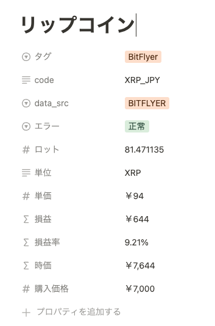

# notion-asset-aws-lambda
Python code on AWS Lambda that fetches stock price data from various sources and updates notion pages. Corresponding notion database(table) must be aligned to a certain format (prop names and types).

## Runtime Configurations
Python 3.11 x86_64

## Usage Limitations
Since this function fetches data from various public (but enterprise) sources, only non-frequent private use is expected.

## Data Source
Contact me for each url prefix for these sources.
| Type      | Source | URL Prefix| URL Format|
|-----------|--------|-----------|-----------|
|Cryptos|bitflyer.com|`PREFIX_CRYPTO`|`PREFIX_CRYPTO`+`code`|
|Indices|minkabu.jp|`PREFIX_INDEX`|`PREFIX_INDEX`+`code`|
|Stocks|minkabu.jp|`PREFIX_STOCK`|`PREFIX_STOCK`+`code`|
|Gold|sbi.co.jp|`PREFIX_GOLD`|`PREFIX_GOLD`|

## Modules and Layers

| Name      | Comments |
|-----------|----------|
| reportlab | For pdf creation|
| aiohttp   | For async http requests |

## Enironmental values required
- `API_KEY`: API key for a notion integration
- `DATABASE_ID`: Notion Database Id for the database which has info about your assets
- `EVENT_PWD`: User Passwordn to be used to check when the function URL is triggered
- `EVENT_USER`: User Id to be used to check when the function URL gets triggered
- `PREFIX_CRYPTO`: URL prefix for crypto data sources (bitflyer)
- `PREFIX_INDEX`: URL prefix for index data sources (minkabu)
- `PREFIX_STOCK`: URL prefix for stock data sources (minkabu)
- `PREFIX_GOLD`: URL prefix for gold data source (sbi)

## How to use
Trigger(POST) the function URL with headers with EVENT_PWD and EVENT_USER as password and user respectively.

## Response format
Case 1 [If no password and no user provided]: **Returns `400 Bad Request`**

Case 2 [If provided password or user is invalid]: **Returns `401 Unauthorized` with body containing input user & password**

Case 3 [Successfully finished]: **Returns `200 OK` with body which has summary and the base64-encoded pdf report of the result**

## Architecture

## Result on Notion

(Function updates the "単価"(price) property)

## PDF Report

